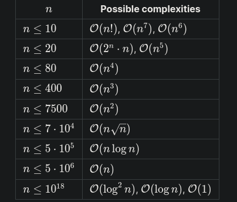

# USACO Guide (Bronze)
Time limit for execution for usaco is 2 seconds.

## Some common runtimes
Mathematical formulas that just calculate an answer: $\mathcal{O}(1)$

Binary search: $\mathcal{O}(\log n)$

Ordered set/map or priority queue: $\mathcal{O}(\log n)$ per operation

Prime factorization of an integer, or checking primality or compositeness of
an integer naively: $\mathcal{O}(\sqrt{n})$



Very handy formula for intersection of two lines (full real dumb right now)
```
calculate the answer by adding the original lengths and subtracting the
intersection length.
$$(b-a)+(d-c)-\text{intersection}([a,b],[c,d])$$
The
official analysis
splits computing the intersection length into several cases. However, we do it
more simply here. An interval $[x,x+1]$ is contained within both $[a,b]$ and
$[c,d]$ if $a\le x$, $c\le x$, $x, and $x. In other words,
$\max(a,c)\le x$ and $x<\min(b,d)$. So the length of the intersection is
$\min(b,d)-\max(a,c)$ if this quantity is positive and zero otherwise!
```


